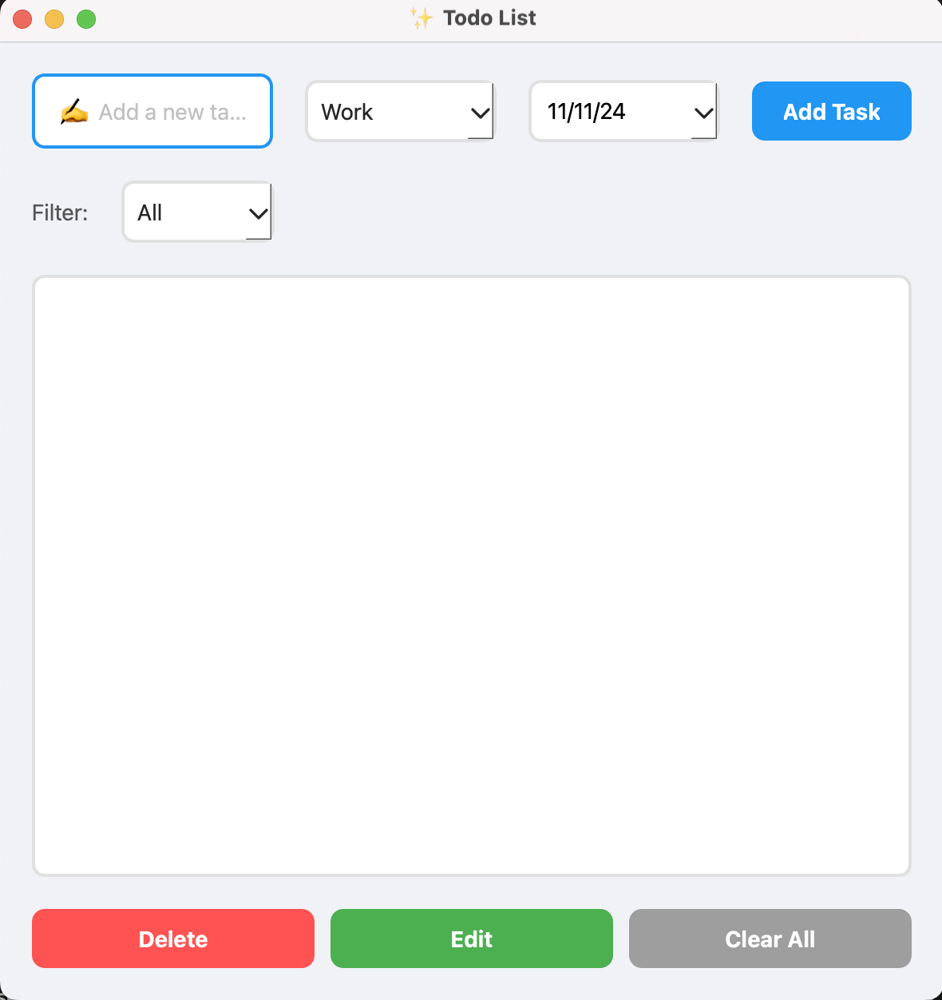

# Modern Todo List Application

A clean and modern Todo List application built with PySide6, featuring task management with categories, status tracking, and due dates.

## Features

- 📝 Create, edit, and delete tasks
- 📋 Categorize tasks (Work, Personal, Shopping, Other)
- ✅ Track task status (Not Started, In Progress, Completed)
- 📅 Set due dates for tasks
- 🔍 Filter tasks by category and status
- 🎨 Modern and clean user interface
- 💫 Interactive hover effects

## Requirements

- Python 3.x
- PySide6

## Installation

1. Clone the repository:
   bash
   git clone https://github.com/yourusername/todo-app.git
   cd todo-app

2. Create a virtual environment:
   bash
   On macOS/Linux
   python3 -m venv env
   source env/bin/activate

3. Install required packages:
   bash
   pip install PySide6

## Running the Application

1. Make sure your virtual environment is activated
2. Run the application:

bash
python todo.py

## How to Use

### Adding Tasks

1. Enter your task in the input field
2. Select a category (Work, Personal, Shopping, Other)
3. Choose a status (Not Started, In Progress, Completed)
4. Set a due date
5. Click "Add Task"

### Managing Tasks

- **Edit**: Select a task and click "Edit"
- **Delete**: Select a task and click "Delete"
- **Change Status**: Select a task and click "Change Status"
- **Clear All**: Remove all tasks with "Clear All"

### Filtering Tasks

Use the dropdown menus at the top to filter tasks by:

- Category (All Categories, Work, Personal, Shopping, Other)
- Status (All Status, Not Started, In Progress, Completed)

## Project Structure

todo-app/
├── todo.py # Main application file
├── README.md # Documentation
└── env/ # Virtual environment directory
